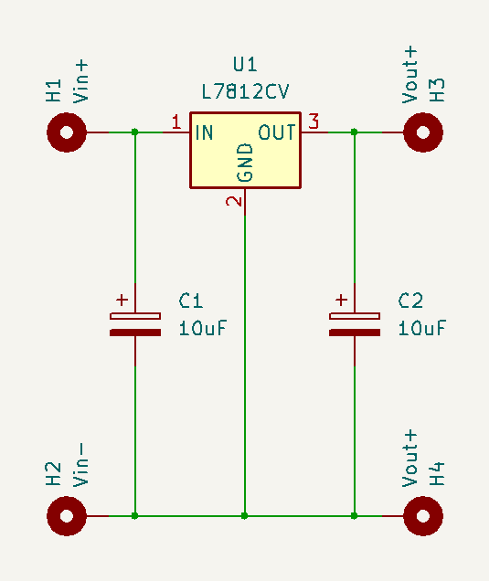
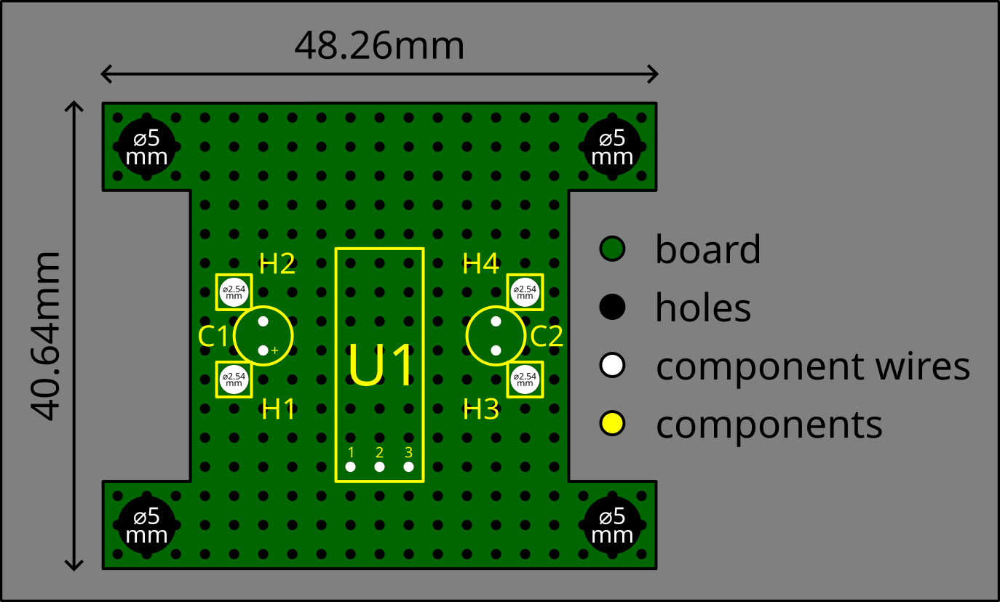
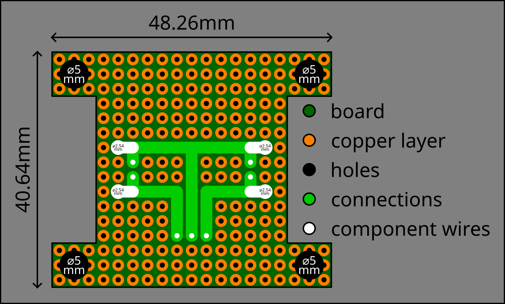
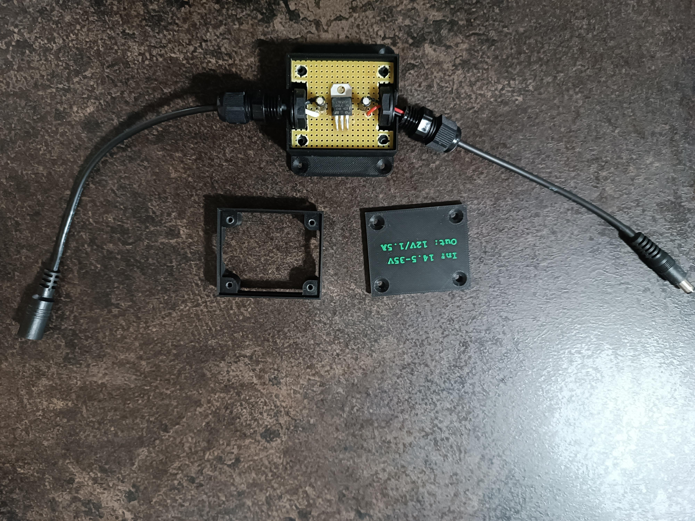
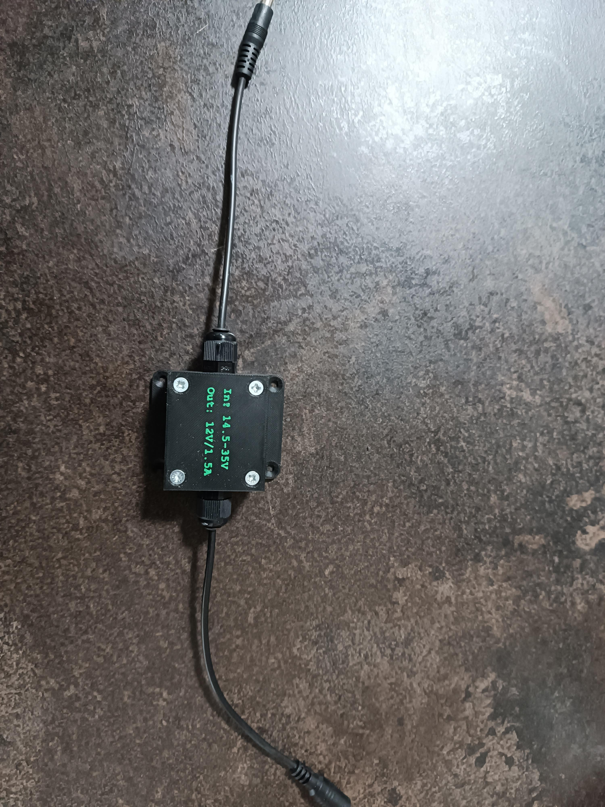

# Step-down converter 12V

This is the documentation of DC-to-DC step-down converter converting 14.5-35V to 12V (max 1.5A of the output current).

Below, you can see the converter circuit scheme (also available in the `.kicad_sch` format):

**NOTE:** To change the output voltage/max current value, replace the regulator IC LM7812CV (`U1`) with the corresponding LM78xx regulator IC.

Below, you can see both sides of the converter PCB design (also available in the `.svg` format, the design uses an universal drilled PCB with 2.54mm hole pitch):

The repository also includes printable 3D models (one single-color `.stl` file without label, one multi-color `.3mf` file with label) of cases for the PCB. For assembling the case, you need 4 additional screws (e.g. 3.5×30mm screws) and two cable glands M12×1.5 needs to be used.

Below, you can see an example of the built hardware:

## Authors

- [**Eli Nucknack**](mailto:eli.nucknack@gmail.com)
